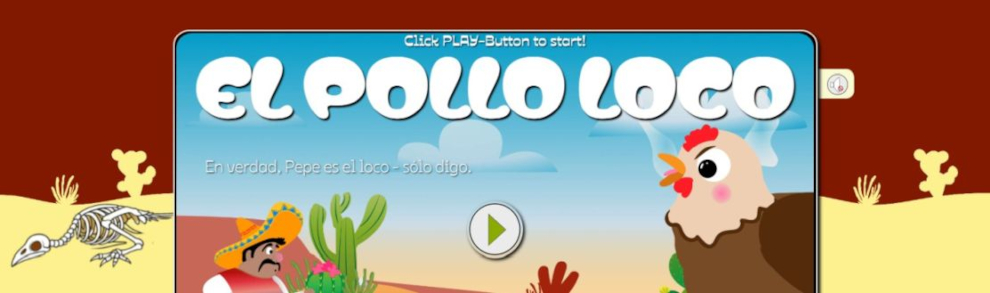

# EL POLLO LOCO - Jump'n'Run Game

 The game is built entirely in Vanilla JavaScript using an object-oriented class hierarchy rendered on an HTML5 Canvas. An additional task in this project was to develop the game logic and to supplement the provided illustrations with custom images and styles.

## TechStack

* Vanilla Javascript
* CSS

## Structure

* Level
* HighscoreManager
* Keyboard
* DrawableObject
  ├─ CollectableObject
  ├─ CountableItem
  ├─ Bottle
  ├─ Coin
  ├─ MovableObject
     │  ├─ movingBackground
     │  ├─ Clouds
     │  ├─ Chicken
     │  ├─ MiniChicken
     │  ├─ Endboss
     │  ├─ Pepe
     │  ├─ CollidableObject
        └─ ThrowableObject
  └─ StaticObject
        ├─ staticBackground
        ├─ StatusBarChilli
        ├─ StatusBarCoin
        ├─ StatusBarEndboss
        └─ StatusBarPepe
